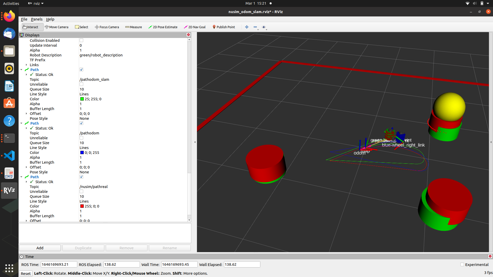

# ME495 Sensing, Navigation and Machine Learning For Robotics
* Ian Kennedy
* Winter 2022


# Package List
This repository consists of several ROS packages

- nuturtle_description - This package provides simulation visualization of the robot and navigation environment

- turtlelib - This package provides 2D transform functionality for transforms, vectors, and twists. It also provides a diff_drive class that computes differential drive forward and inverse kinematics operations(wheel speeds, configuration updates)

- nusim - This package provides a simulator that loads in a turtlebot, and obstacles

- nuturtle_control - This package provides the ability to launch the robot in simulation, or run the same operations on an actual turtlebot

- nuslam - provides SLAM functionality to the turtlebot
\

The blue robot represents the pure odometry estimate of the robot, while the green bot represents the EKF-based SLAM position of the robot. Green markers represent the estimated location of landmarks in the environment, that are identified from clustering and circle ML algorithms. Data association was implemented using a Mahalanobis distance algorithm.

Demo of RVIZ video:


## Homework 2 part F5

3) Translation:

Link to robot: https://drive.google.com/file/d/1AzpSwEo9grCCmoY7lxJT187gYdEGyNmx/view?usp=sharing
   
   Link to screencast: https://drive.google.com/file/d/15dOnWCe42oUJuRQDghp9oP_yB6Jmo0dN/view?usp=sharing
```
  Initial:
  Position: 
  x = 0.016
  y = -0.002
  z = 0.0
  Orientation:
  x = 0.0
  y = 0.0
  z = -0.102
  w = 0.995

  Final:
  Position:
  x = 0.053
  y = -0.002
  z = 0.0
  Orientation:
  x = 0.0
  y = 0.0
  z = -0.100
  w = 0.995
```

4) Rotation:

Link to robot: https://drive.google.com/file/d/13RPxtaOm12t-Xrh6S8JmqFfrzfNpWfNv/view?usp=sharing
   
   Link to screencast: https://drive.google.com/file/d/1Jbl81E1kaekMMgFdaWTakK0uF7vg51CF/view?usp=sharing
```
  Initial:
  Position:
  x = 0.016
  y = -0.002
  z = 0.0
  Orientation:
  x = 0.0
  y = 0.0
  z = -0.102
  w = 0.995

  Final:
  x = 0.017
  y = -0.002
  z = 0.0
  Orientation:
  x = 0.0
  y = 0.0
  z = -0.01
  w = 1.0
```

5) Circle:

  Link to robot: https://drive.google.com/file/d/1ViW6NKLse1pyBXMsqrGQ9CDAkWtgXxh_/view?usp=sharing
  
  Link to screencast: https://drive.google.com/file/d/1z8wFrE-Ro_8wWGI8-GghpLvaYBAziMoJ/view?usp=sharing

      Initial:
      Position: 
      x = 0.016
      y = -0.002
      z = 0.0
      Orientation:
      x = 0.0;
      y = 0.0;
      z = -0.102
      w = 0.995

      Final:
      Position:
      x = 0.03
      y = -0.005
      z = 0.0
      Orientation:
      x = 0.0
      y = -0.006
      z = -0.048
      w = 0.999
   


6) Better rotation:

  In order to attempt to produce a a better result, I redid the pure rotation case at a higher velocity. The thought behind this would prevent error from integrating over time (since the 6 rotation sequence would take less time). I observed  the same resultant positions, and my  z angle delta was smaller.
  
  Link to robot: https://drive.google.com/file/d/15d1a8byV0SeijollelklCSS1RCpoYB5S/view?usp=sharing
  
  Link to screencast: https://drive.google.com/file/d/1q7sa-_bhLHoNd07hHJ9vpxAX41cQIB01/view?usp=sharing

    Initial:
    Position:
    x = 0.016
    y = -0.002
    z = 0.0
    Orientation:
    x = 0.0
    y = 0.0
    z = -0.103
    w = 0.995


    Final:
    x = 0.016
    y = -0.002
    z = 0.0
    Orientation:
    x = 0.0
    y = 0.0
    z = -0.082
    w = 0.997


## Homework 3 part L

Here is an RVIZ screenshot showing the SLAM algorithm localizing the green robot to the red truth. Blue represents a pure odometry based estimate when. Paths are also plotted in the respective robot colors. red markers represent the true position of the obstacles, and green are the estimated positions using the SLAM algorithm.

Noise parameters:

basic_sensor_variance: 0.003

electronic motor noise variance: 0.003

slip_min: -0.0001

slip_max: 0.0003




source for .gitignore file (01/15): https://codicious.wordpress.com/2018/06/06/how-would-you-exclude-all-extension-less-executable-from-your-repo/