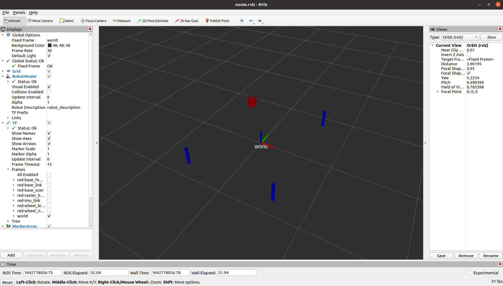

# Nusim Simulator

## Descriptions

This package contains the source code, launch file and environmental parameters used to
launch and view the `nusimulator` in RVIZ. Simulation is run using parameters in basic_world.yaml.

## Contents

launch/nusim.launch: this launch file launches tthe nusim node, RVIZ, and loads in the robot_descriptions and adds obstacles

config/basic_world.yaml: 

x0: x origin of robot in the world frame

y0: y origin of robot in the world frame

theta0: theta (z angle) of robott in the world frame

rate: publishing rate of the nusim node

obstacles/x: obstacles x coordinates in the world frame

obstacles/y: obstacles y coordinates in the world frame

obstacles/r: radius of obstacle

## Screenshot

RVIZ screenshot:

