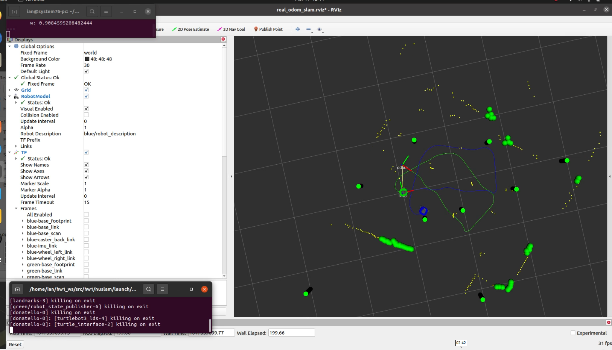

## Nuslam package

This package launches a SLAM algorithm to map an environment. Angular units are in radians, linear units are in meters

To run this, run the following command (setting use_rviz to false will launch without RVIZ, and setting the config_file argument will load a different world yaml file):


```
roslaunch nuslam slam.launch use_rviz:=true
```


To run the simulation SLAM alghorithm with unknown data association:

```
roslaunch nuslam unknown_data_assoc.launch
```

To run the simulation SLAM alghorithm with unknown data association on a robot (must cross compile first):


```
roslaunch nuslam unknown_data_assoc.launch robot:=<robot name>
```
To visualize the clustering algorithm in simulation:

```
roslaunch nuslam landmark_detect
```

To visualize on the real robot:

```
roslaunch nuslam landmark_detect robot:=<robot name>
```

## Homework 4 part L.3

Screencast of the simulation run:

https://drive.google.com/file/d/1rGqEWzJ73u9DkPSYKAw-l_lXY0nMsU-h/view?usp=sharing


SLAM end pose estimate:
``` 

  x:  0.020
  y:  0.007
  theta:  6.265
```

Odom end pose estimate:
```
  x: -0.232
  y: 0.045
  theta:  0.652    
```
Robot end pose estimate:
```
  x: 0.020
  y: 0.006
  theta: -0.022
 ```     

Odom - robot error:
```
  x: -0.252
  y: 0.038
  theta: 0.674
 ``` 

 SLAM - robot error:
 ```
  x: 0.000
  y: 0.001
  theta: 0.004
 ``` 

## Homework 4 part L.4

Screenshot of the end pose of the odom and SLAM robot estimates:



Screencast in RVIZ of the path throught the environment

https://drive.google.com/file/d/1C0U9qCg2q9P-zMxYQsHEmFydiTOCpTqX/view?usp=sharing

Recording of the robot navigating in turtleland:

https://drive.google.com/file/d/1Hz2HVzbBnOYEGDH3OZDgmbzveSlQzkVu/view?usp=sharing


Final odom and slam robot positions:


Odom pose estimate :
```
  x: 0.310
  y: -0.369
  theta: 0.863
```

SLAM pose estimate:
 ```
  x:  0.049
  y:  0.011
  theta:  6.335 (0.052)
```


For rotation conversion pertaining to the homework 4 results, this tool was used on 03/17: https://www.andre-gaschler.com/rotationconverter/
